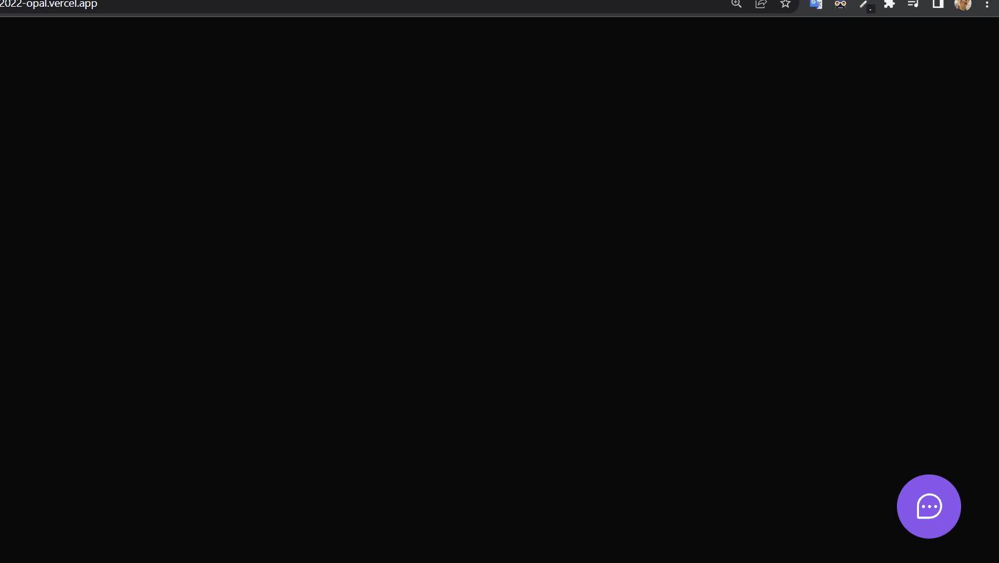
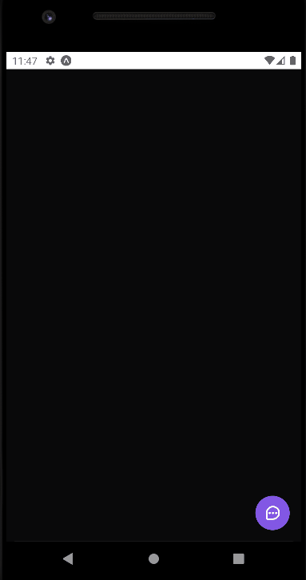

 <h1 align="center">Envio de informações</h1>

Esse é um projeto desenvolvido na Next Level Week da Rocketseat que pega informações do usuário sobre o site e manda para o email do administrador

---

  
  

---

# See the repositories

## - [REST API](https://github.com/isaaacwillian/NLW-Server)

## - [Web](https://github.com/isaaacwillian/NLW-Web-2022)

## - [Mobile](https://github.com/isaaacwillian/NLW-Mobile)

---

## 🚀 Technologies

⚙️ Principais tecnologias:

- ✔️ReactJS

- ✔️NodeJS

- ✔️React Native

- ✔️Typescript

- ✔️Express

- ✔️Tailwind CSS

- ✔️PostgreSQL

- ✔️Prisma

#

Made with 💙
